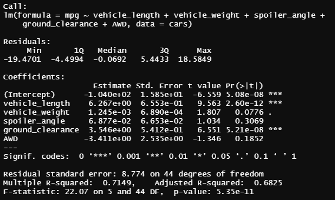
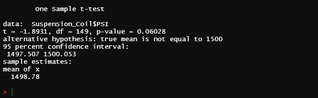
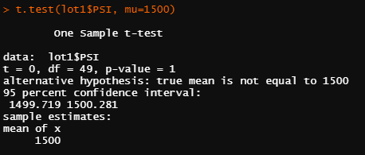
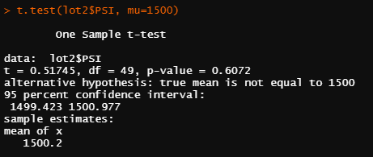
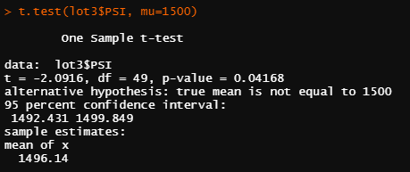

# MechaCar Analysis

## <u>MechaCar Analysis</u>
### Jeremy, a data analyst at AutosRUs, has been tasked to look into the production troubles of the newest protype, the MechaCar. Several statistical tests will need to be performed in order to find out what the issue is.
 

## <u> Linear Regression to Predict MPG</u>
 

### As can be seen in the above multi-linear regression model, intercept, vehicle length, vehicle weight, and ground clearance are statistically unlikely to provide random amounts of variance to the linear model. This means that the aforementioned variables have a significant impact on the mpg metric. The r-squared value of 0.71 tells us that correlation between all the variables and the mpg are relatively high. This means that roughly 71% of the data has a significant impact on the prediction of the mpg metric.

 

## <u>Summary Statistics on Suspension Coils</u>
 

MechaCar suspension coils dictate that the variance of the suspension coils must not exceed 100 pounds per square inch. Lot 1 and Lot 2 meet the specification. However, Lot 3 is not meeting the design specification, since the variance is 170.3 PSI, exceeding the specification by 70.3 PSI. If one would have only looked at the total_summary variance of 62.3, one may have come to the wrong conclusion that the variance is within specification. Therefore, it is important to examine each manufacturing lot individually, in order to make sure that the design specification is being met.

## <u>T-Tests on Suspension Coils</u>

 ### As the t-test result show above, there is no statical difference from the population mean of 1500 PSI across all manufacturing lots.
 

### Lot 1 is very close to the population mean, as can be seen from the t-test results above. Having a p-value of one, we can ascertain that there is no statistical difference in PSI between manufacturing lot 1 and the population mean of 1500 PSI.
 

### Although not as close as lot 1, lot 2 is also very close to the true mean of the population. Having a p-value of 0.61, we can ascertain that there is no statistical difference in PSI between manufacturing lot 2 and the population mean of 1500 PSI.
 

### Lot 3, in comparison to the other two, is statistically different. As can be seen above, the p-value of 0.04 is below the normal significance level of 0.05. Meaning that the probability of being statically different is high. Therefore, we can conclude that lot 3 is statistically different.
 

## <u>Study Design: MechaCar vs Competition</u>

- ### Metrics:
    In order to get a better understanding of our competition, the company needs to first determine what the costumer is most likely to be interested in. For our example, we will use fuel efficiency and general safety ratings as our data points.
- ### Null Hypothesis:
    There is no correlation on average between fuel efficient cars and their safety ratings.
- ### Alternative Hypothesis:
    Fuel efficient cars are on average safer than cars with lower fuel efficiency.

- ### Statical Tests:
    Before deciding on what statistical test to use, we need to make sure that our sample population contains minimal bias and is as close as possible to the population data.
    After making sure that our data is numerical and continuous, and that our sample data is normally distributed, we can now perform a t-test. This will help us determine if we should reject or fail to reject the null hypothesis. Our significance level should be set to the normal p-value of 0.05. This needs to be done before we analyze the data, so that minimal bias is introduced. If we are able to reject our null hypothesis, we could then use a simple linear regression test to determine if there is a strong correlation between safety and car fuel efficiency across all car manufacturers. Doing so will also give us r-squared value. This should further help us determine how high/low the correlation between the two metrics is.

- ### Required Data:
    To perform the statistical tests mentioned above, we would need to get data that shows all manufacturer’s car fuel efficiency metrics and their corresponding safety ratings. 

- ### Conclusion:
    If we determine that there is a statistical difference between fuel efficiency and car safety ratings, the company could use that as a competitive advantage over other car manufactures. If there is no statistical difference, however, the company could look at other metrics such as price vs horse power, or maintenance cost vs car safety. There are numerous statistical tests that can be performed in order to gauge what the competition is doing.

